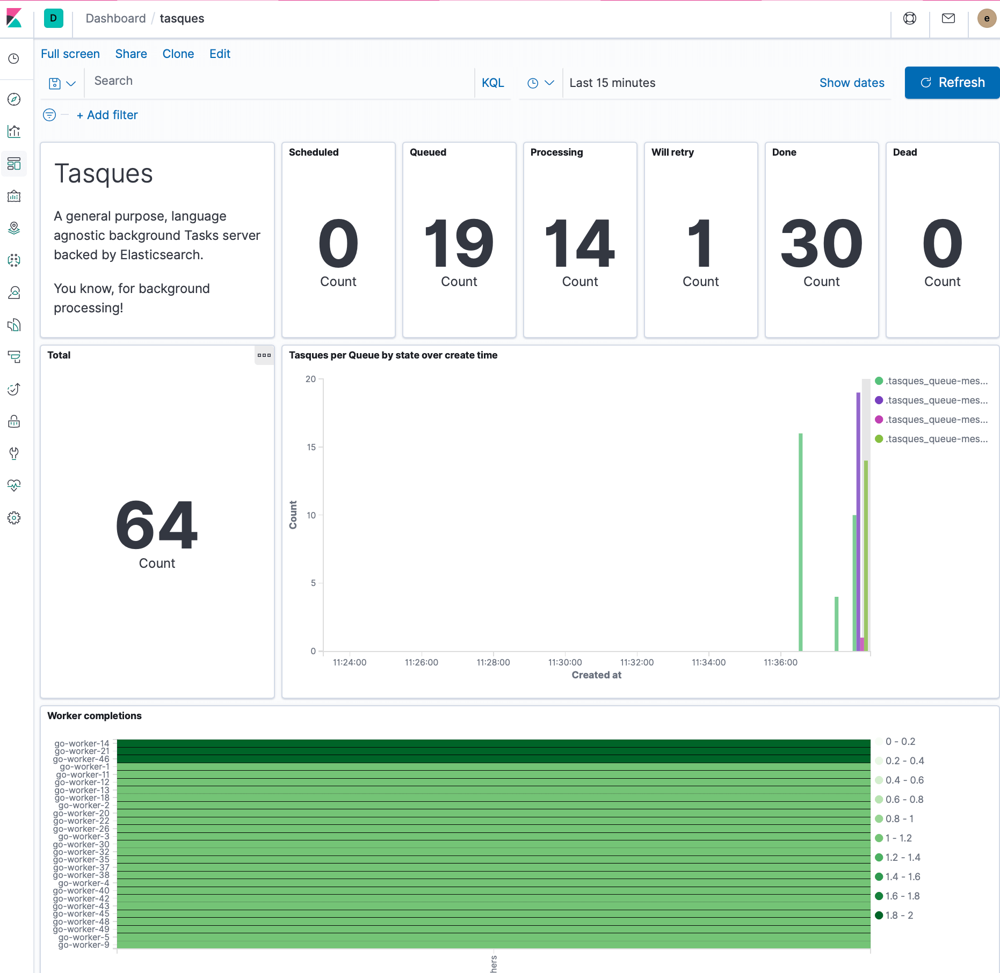
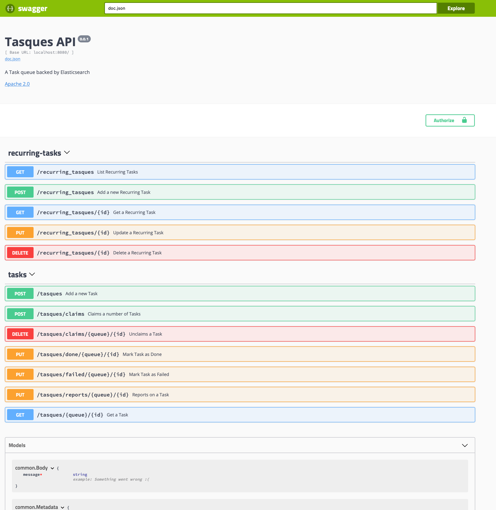
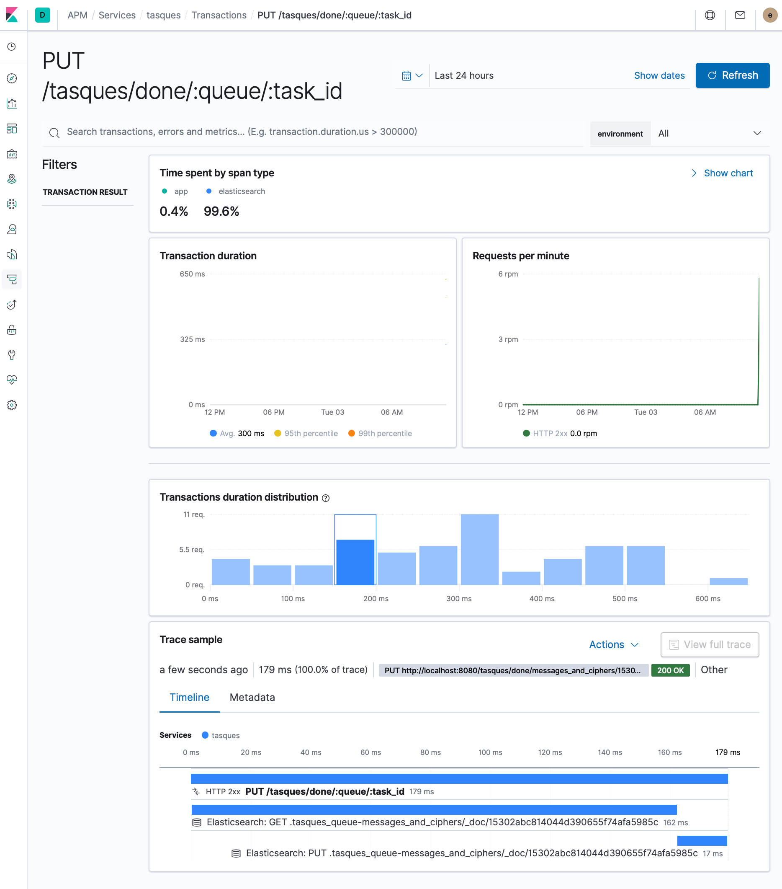

## Tasques    

> Task queues backed by Elasticsearch (ES): Tasques 
>
> Pronounced: /tɑːsks/, like "tasks"
> 
> You know, for Background Tasks !

Why use ES as a Tasks data store? It's horizontally scalable, highly-available, and offers a lot of built-in ways to manage your data
(lifecycle management, snapshots, etc).

  

### Features:

- Easily scalable:
  - Servers are stateless; just spin more up as needed
  - The storage engine is Elasticsearch, nuff' said.
- Tasks are configurable:
  - Priority
  - Schedule to run later
  - Retries with exponential increase in retry delays.
- Idempotency
- Recurring Tasks that are repeatedly enqueued at configurable intervals (cron format with basic macro support à la 
  `@every 1m`)
  - Also supports skipping if outstanding Tasks exist for a given Recurring Task
- Timeouts for Tasks that are picked up by Workers but either don't report in or finish on time.
- Archiving of completed Tasks (DONE or DEAD), also configurable
  - If Index Lifecycle Management (ILM) is enabled (default), the archive index is set to roll over automatically for 
    easy management of old data. 
- Unclaiming allows Tasks that get picked up but can't be handled to be requeued without consequence.
- API is exposed as Swagger; easily generate clients in any language:
  - Use the client to enqueue Tasks from your application
  - Workers are just a loop around the client, then your own business logic to do the actual work.
- Pre-seeded Kibana Index Patterns and Dashboards for monitoring tasks.
- Simple configuration: use a config file, optionally override with environment variables (12 factor-ready).
- Application Performance monitoring: metrics are exported to [APM](https://www.elastic.co/apm) and available again from
  Kibana (more below)

### Usage

#### Running

Tasques is available as a [small Docker image](https://hub.docker.com/repository/docker/lloydmeta/tasques), with images
published automatically by CI upon pushes/merges to `master` and tag pushes.

To get a quick idea of what is included and how to get up and running with Kubernetes:

1. Go to `docker/k8s` and run `make install-eck deploy`, and wait until the pods are all ready (`kubectl get pods`)
2. For Swagger, go to [localhost:8080/swagger/index.html](http://localhost:8080/swagger/index.html)
    
3. To log into Kibana for dashboards and APM stats, run `make show-credentials` to get the `elastic` user password, and
   go to [localhost:5601](http://localhost:5601) to log in.

There is also an example project that demonstrates the application-tasques-worker relationship more thoroughly; please
see `example/ciphers` for more details.

### Monitoring

  

The server supports APM, as configured according to the [official docs](https://www.elastic.co/guide/en/apm/agent/go/current/getting-started.html#configure-setup).

### High availability

The Tasque server is in principle stateless; but there are internal recurring jobs that need to be taken care off, like
monitoring claimed Tasks and timing them out as needed, and scheduling recurring Tasks.

These internal jobs only occur on the Leader server, as determined by a leader lock. By spinning up more than one Tasque server,
you not only gain the benefits of being able to handle more load, but also shield yourself from potential disruptions in the running
of these internal Tasks, as a new Leader will be elected and take over if the current Leader loses connectivity or is terminated.

Running multiple servers also allows for zero-downtime rollouts of new versions of Tasques server.

### Delivery

Assuming there is no data loss at the ES level, Tasques provides at-least-once delivery, ensuring that it only allows a
single Worker (identified by Id) to have claim on a Task at any given time.

If there is data loss/recovery (snapshot recovery, ES node loss), jobs might be handed out twice, so it's a good idea to 
make job handling idempotent.

### Idempotency

When submitting/creating a Task, you can optionally specify an "id" field, which acts a Queue-specific idempotency key
(a UUID is generated and used if not specified). If there is already a Task in the Queue you specified with that key, 
the submission will fail.

Note that idempotency is only for un-archived Tasks: it's possible for a Task to be created with the same Id as another 
already archived Task. The `archive_older_than` period config can be tweaked if this is an issue.

### Recurring Tasks

Tasques comes with support for scheduling Tasks enqueued at a given cron expression (delegating to [robconfig/cron](https://github.com/robfig/cron),
so check there for supported expressions).

There is also support to skip enqueueing Tasks for a Recurring Task if there are existing outstanding (not dead or done)
that belong to it. For high-frequency Recurring Tasks (higher than once every ~2 seconds) this is subject to limitations
in ES itself, since it refreshes Indices on a [configurable interval](https://www.elastic.co/guide/en/elasticsearch/reference/current/indices-refresh.html).
To address this, you can configure the ES index refresh interval to be more frequent, or you can configure
tasques itself to be more aggressive about refreshing indices (see `config/tasques.example.yaml` for details).  

### Dev

Requires [Go](https://golang.org) 1.13+.

1. [Install `Go`](https://golang.org/doc/install)
2. Use your favourite editor/IDE
3. For updating Swagger docs:
    1. Install [Swaggo](https://github.com/swaggo/swag#getting-started)
    2. Run `swag init -g app/main.go` from the root project dir
        * Check that there are no `time.Time` fields... there's a race condition in there somewhere
    3. Commit the generated files.
4. For updating the Go Client:
    1. Install [go-swagger](https://goswagger.io/generate/client.html)
    2. Run `swagger generate client -f docs/swagger.yaml`
    3. Commit the generated files.
    
### Running tests

**Unit tests**: `go test ./...`

**Integration tests**: `go test -tags=integration ./...` (finds `// +build integration` at the top o IT files)

#### Code guidelines

The code emphasises the following:

1. **Safety**: the code needs to do the right thing. Use built-in features (locks, typed ids) and tests to help maximise safety.
2. **Efficiency**: the server and its code should be reasonably efficient so that it can handle high loads.
3. **Observability**: where reasonable, pass a `Context` around so we can export performance metrics. This is a must when making any kind of IO call.
4. **High availability**: the server needs to be able to run in a highly available way to maximise robusness.
5. **Simplicity**: the API needs to be simple and easy to use
6. **Maintainability**: the internals need to be as simple as possible and invite contributions. Use the rule of 3 to know when something should be generalised. If in doubt, repeat yourself.

### Credit

This project was inspired by the following, in no particular order

* [Celery](http://www.celeryproject.org)
* [Resque](https://github.com/resque/resque)
* [Sidekiq](http://sidekiq.org)
* [Faktory](https://contribsys.com/faktory/)
* [esqueue](https://github.com/elastic/esqueue)