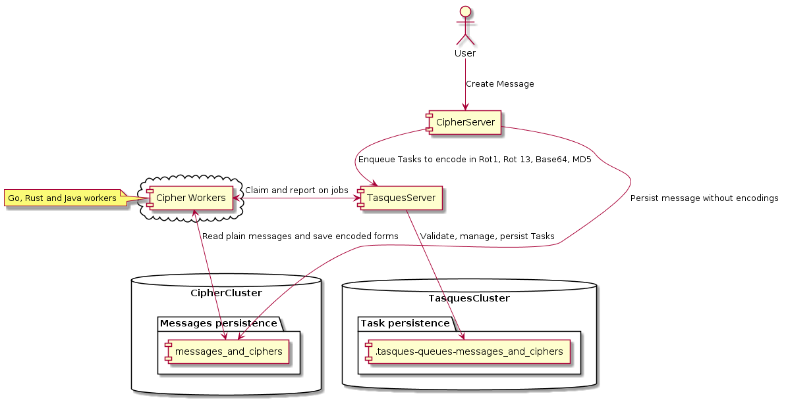

## Ciphers

This is an example server-worker app.

There are 2 main sets of components:

1. Cipher App Server, Cipher ES DB, and Cipher Workers
2. Tasques Server, Tasques ES DB, Kibana and APM

(1) is the actual application logic and (2) is Tasks management.  

  

A User POSTs a plain text message to the Cipher App Server, which persists it into its DB and enqueues background Tasks
to have the plain text message encoded into different forms (Rot13, Base64, etc) by making requests to the Tasques Server.

Cipher Workers claim Tasks that they can handle by asking for Tasks in the `messages_and_ciphers`s queue, encoding into
the right form as indicated by the Tasks, saving the encoded form to the Ciphers DB, and reporting each Task as done. 

### Setup

If you don't have [Kubernetes](https://kubernetes.io) installed, install it.

If you don't have EC installed,  run `make install-eck` to install the [ECK](https://www.elastic.co/guide/en/cloud-on-k8s/current/index.html) operator.

Run `make k8s-deploy` to deploy all the needed infra, such as Tasques, including ES clusters (for tasques and our demo app), 
Kibana, and APM.

### Run the Ciphers server

Run `make start-cipher-server` to start the web server for Ciphers. It will wait for the previous services to be ready before
starting.

#### Add some Messages to cipher

Once the Ciphers server is up, go to the server at [localhost:9000](http://localhost:9000) (default) and use the form to
create plain text messages, which will create jobs to have them encoded by workers.

### Run the Ciphers Go workers

Run `make start-go-workers` to start a number of Go Cipher workers. By default, we start 5, but you can customise this using
`GO_WORKER_COUNT` (e.g. `GO_WORKER_COUNT=10 make start-go-workers`). Also note that half of the workers are configured
to have a chance of failure, and all have an artificial pause to simulate load.

#### Workers in other languages

There are example workers in Java and Rust as well (`worker-$lang`)

### Kibana Dashboard

1. To log into the Tasques server's Kibana, run `make k8s-show-credentials` and get the password of the **Tasques** cluster.
2. Then go to [localhost:5601](http://localhost:5601) and use `elastic` and the password retrieved in the previous step.
3. Use the Kibana navigation bar to go to Dashboards, then select the `tasques` dashboard from the list. 